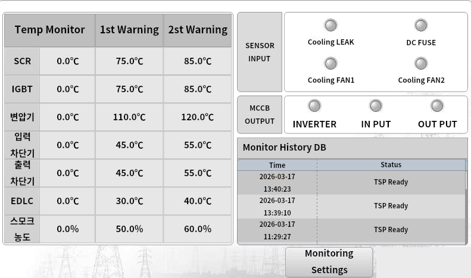

## 1. 프로젝트 개요

- **프로젝트명**: TspMonitor
- **앱 이름**: TspMonitor
- **목적**: 수냉식 100kVA TSP(Transient Sag Protector) 장비의 온도·전류·센서·알람 상태를 실시간 모니터링하고, 경고 온도 설정값 및 보정값을 관리하는 HMI 프로그램
- **해상도**: 1024x600
- **테마**: Dark

---

## 2. 화면 구성

### 페이지 목록

#### MonitoringPage
- **역할**: TSP 장비의 실시간 상태 모니터링 (온도, 센서 입력, MCCB 출력, 이력)
- **레이아웃**: 
- **주요 컨트롤**:
  - **Temp Monitor 테이블** (좌측): SCR, IGBT, 변압기, 입력차단기, 출력차단기, EDLC 온도 현재값 및 1차/2차 Warning 설정값 표시, 스모크 농도(%) 포함
  - **SENSOR INPUT 영역** (우상단): Cooling LEAK, DC FUSE, Cooling FAN1, Cooling FAN2 상태 램프 (비트 데이터 기반)
  - **MCCB OUTPUT 영역** (우중단): INVERTER, INPUT, OUTPUT 상태 램프 (비트 데이터 기반)
  - **Monitor History DB 테이블** (우하단): 시간(Time)과 상태(Status) 이력 표시
  - **하단 버튼**: `Monitoring` (현재 페이지), `Settings` (SettingWindow 열기)
- **페이지 이동**: 없음 (단일 페이지)
- **열리는 윈도우**: `Settings` 버튼 → SettingWindow

### 윈도우(팝업) 목록

#### SettingWindow
- **트리거**: MonitoringPage의 `Settings` 버튼
- **역할**: 장비 설정값 조회 및 변경 (설비 시기, 모델번호, 보정 전류, 입력 전류 확인)
- **레이아웃**: 
- **주요 컨트롤**:
  - **좌측 온도 표시**: SCR, IGBT, 변압기, 입력차단기, 출력차단기, EDLC 현재 온도, 연기 농도(%) 표시 (읽기 전용)
  - **우측 설정 영역**:
    - 설비 시기 (YYMM.DD 형식)
    - 모델번호
    - Correction R / S / T (보정 전류값, 0.1A 단위)
    - IN-R / IN-S / IN-T (입력 전류 확인)
  - **CLOSE 버튼**: 윈도우 닫기
- **반환값**: 없음 (설정값은 Modbus Write로 직접 반영)

---

## 3. 통신

### Modbus RTU

- **포트명**: COM1
- **보드레이트**: 115200
- **패리티**: None (N.8.1)
- **타임아웃(ms)**: 1000

**슬레이브 구성**

| 슬레이브 번호 | 역할 |
|-------------|------|
| 1 | RP2040 메인 컨트롤러 (GO_RP2040_CB10T06A02) |

**레지스터 맵 — Data Read (FC3, 표1-1)**

| 주소 | 명칭 | 설명 | 단위 | 데이터형 | R/W | FC |
|------|------|------|------|---------|-----|-----|
| 0x7001 | RunState | 보드 상태 (0=wait, 1=run) | - | Word | R | FC3 |
| 0x7002 | AlarmState | 알람 상태 | - | Bit | R | FC3 |
| 0x7003 | SensorInput | 입력 상태 (0=none, 1=LEAK, 2=FUSE, 4=EMO, 8=FAN1, 16=FAN2) | - | Bit | R | FC3 |
| 0x7004 | MccbOutput | 출력 상태 (0=none, 1=INVERTER, 2=INPUT, 4=OUTPUT) | - | Bit | R | FC3 |
| 0x7005 | R_Current | R상 전류 (0.0~750.0A, 750.0A=7500) | 0.1A | Word | R | FC3 |
| 0x7006 | T_Current | T상 전류 (0.0~750.0A) | 0.1A | Word | R | FC3 |
| 0x7007 | S_Current | S상 전류 (0.0~750.0A) | 0.1A | Word | R | FC3 |
| 0x7008 | SCR_Temp | SCR 온도 (-20.0~90.0℃) | 0.1℃ | Word | R | FC3 |
| 0x7009 | IGBT_Temp | IGBT 온도 (-20.0~90.0℃) | 0.1℃ | Word | R | FC3 |
| 0x700A | Trans_Temp | 변압기 온도 (-20.0~90.0℃) | 0.1℃ | Word | R | FC3 |
| 0x700B | InBreaker_Temp | 입력차단기 온도 (-20.0~90.0℃) | 0.1℃ | Word | R | FC3 |
| 0x700C | OutBreaker_Temp | 출력차단기 온도 (-20.0~90.0℃) | 0.1℃ | Word | R | FC3 |
| 0x700D | EDLC_Temp | EDLC(슈퍼캡) 온도 (-20.0~90.0℃) | 0.1℃ | Word | R | FC3 |
| 0x700E | Temp7 | 예비 온도7 (-20.0~90.0℃) | 0.1℃ | Word | R | FC3 |
| 0x700F | Temp8 | 예비 온도8 (-20.0~90.0℃) | 0.1℃ | Word | R | FC3 |
| 0x7010 | Smoke_1 | 연기감지기1 농도 (0~100%) | % | Word | R | FC3 |
| 0x7011 | Smoke_2 | 연기감지기2 농도 (0~100%) | % | Word | R | FC3 |
| 0x7012 | Smoke_3 | 연기감지기3 농도 (0~100%) | % | Word | R | FC3 |
| 0x703B | DspBoardState | DSP 보드 상태 (0=정상, 1=Fault) | - | Bit | R | FC3 |
| 0x703C | BoardStateChange | 보드 상태 변경 (0=wait, 1=run, 100=data_save) | - | Word | R | FC3 |
| 0x703F | TouchBitSetting | 터치 비트 설정 | - | Bit | R | FC3 |

**레지스터 맵 — Data Write (FC6/FC16, 표1-2)**

| 주소 | 명칭 | 설명 | 단위 | 데이터형 | R/W | FC |
|------|------|------|------|---------|-----|-----|
| 0x7015 | SCR_TempSet1 | SCR 1차 Warning 온도 (-20.0~90.0℃) | 0.1℃ | Word | R/W | FC3/FC6 |
| 0x7016 | IGBT_TempSet1 | IGBT 1차 Warning 온도 | 0.1℃ | Word | R/W | FC3/FC6 |
| 0x7017 | Trans_TempSet1 | 변압기 1차 Warning 온도 | 0.1℃ | Word | R/W | FC3/FC6 |
| 0x7018 | InBreaker_TempSet1 | 입력차단기 1차 Warning 온도 | 0.1℃ | Word | R/W | FC3/FC6 |
| 0x7019 | OutBreaker_TempSet1 | 출력차단기 1차 Warning 온도 | 0.1℃ | Word | R/W | FC3/FC6 |
| 0x701A | EDLC_TempSet1 | EDLC 1차 Warning 온도 | 0.1℃ | Word | R/W | FC3/FC6 |
| 0x701B | Temp7_Set1 | 예비 온도7 1차 Warning | 0.1℃ | Word | R/W | FC3/FC6 |
| 0x701C | Temp8_Set1 | 예비 온도8 1차 Warning | 0.1℃ | Word | R/W | FC3/FC6 |
| 0x701D | Smoke1_Set1 | 연기감지기1 1차 Warning (0~100%) | % | Word | R/W | FC3/FC6 |
| 0x701E | Smoke2_Set1 | 연기감지기2 1차 Warning | % | Word | R/W | FC3/FC6 |
| 0x701F | Smoke3_Set1 | 연기감지기3 1차 Warning | % | Word | R/W | FC3/FC6 |
| 0x7021 | SCR_TempSet2 | SCR 2차 Warning 온도 | 0.1℃ | Word | R/W | FC3/FC6 |
| 0x7022 | IGBT_TempSet2 | IGBT 2차 Warning 온도 | 0.1℃ | Word | R/W | FC3/FC6 |
| 0x7023 | Trans_TempSet2 | 변압기 2차 Warning 온도 | 0.1℃ | Word | R/W | FC3/FC6 |
| 0x7024 | InBreaker_TempSet2 | 입력차단기 2차 Warning 온도 | 0.1℃ | Word | R/W | FC3/FC6 |
| 0x7025 | OutBreaker_TempSet2 | 출력차단기 2차 Warning 온도 | 0.1℃ | Word | R/W | FC3/FC6 |
| 0x7026 | EDLC_TempSet2 | EDLC 2차 Warning 온도 | 0.1℃ | Word | R/W | FC3/FC6 |
| 0x7027 | Temp7_Set2 | 예비 온도7 2차 Warning | 0.1℃ | Word | R/W | FC3/FC6 |
| 0x7028 | Temp8_Set2 | 예비 온도8 2차 Warning | 0.1℃ | Word | R/W | FC3/FC6 |
| 0x7029 | Smoke1_Set2 | 연기감지기1 2차 Warning | % | Word | R/W | FC3/FC6 |
| 0x702A | Smoke2_Set2 | 연기감지기2 2차 Warning | % | Word | R/W | FC3/FC6 |
| 0x702B | Smoke3_Set2 | 연기감지기3 2차 Warning | % | Word | R/W | FC3/FC6 |
| 0x702D | CorrectionCurrent1 | 보정 전류 R (±20.0A) | 0.1A | Word | R/W | FC3/FC6 |
| 0x702E | CorrectionCurrent2 | 보정 전류 S (±20.0A) | 0.1A | Word | R/W | FC3/FC6 |
| 0x702F | CorrectionCurrent3 | 보정 전류 T (±20.0A) | 0.1A | Word | R/W | FC3/FC6 |
| 0x7030 | CorrectionTemp1 | 보정 온도 SCR (±20.0℃) | 0.1℃ | Word | R/W | FC3/FC6 |
| 0x7031 | CorrectionTemp2 | 보정 온도 IGBT (±20.0℃) | 0.1℃ | Word | R/W | FC3/FC6 |
| 0x7032 | CorrectionTemp3 | 보정 온도 변압기 (±20.0℃) | 0.1℃ | Word | R/W | FC3/FC6 |
| 0x7033 | CorrectionTemp4 | 보정 온도 입력차단기 (±20.0℃) | 0.1℃ | Word | R/W | FC3/FC6 |
| 0x7034 | CorrectionTemp5 | 보정 온도 출력차단기 (±20.0℃) | 0.1℃ | Word | R/W | FC3/FC6 |
| 0x7035 | CorrectionTemp6 | 보정 온도 EDLC (±20.0℃) | 0.1℃ | Word | R/W | FC3/FC6 |
| 0x7036 | CorrectionTemp7 | 보정 온도7 (±20.0℃) | 0.1℃ | Word | R/W | FC3/FC6 |
| 0x7037 | CorrectionTemp8 | 보정 온도8 (±20.0℃) | 0.1℃ | Word | R/W | FC3/FC6 |
| 0x7038 | CorrectionSmoke1 | 보정 연기감지기1 (±20.0%) | % | Word | R/W | FC3/FC6 |
| 0x7039 | CorrectionSmoke2 | 보정 연기감지기2 (±20.0%) | % | Word | R/W | FC3/FC6 |
| 0x703A | CorrectionSmoke3 | 보정 연기감지기3 (±20.0%) | % | Word | R/W | FC3/FC6 |

**알람 비트맵 (AlarmState 0x7002)**

| 비트 | Hex | 명칭 | 설명 |
|------|-----|------|------|
| 0 | 0x0001 | Leak | 냉각수 누수 (고잉 보드 센싱) |
| 1 | 0x0002 | IGBT_ERR | IGBT 에러 |
| 2 | 0x0004 | OverCurrent | 과전류 |
| 3 | 0x0008 | FuseBroken | 퓨즈 단선 (고잉 보드 센싱) |
| 4 | 0x0010 | SuperCapWarning | 슈퍼캡 1차 경고 (고잉 보드 센싱) |
| 5 | 0x0020 | SuperCapAlarm | 슈퍼캡 2차 알람 (고잉 보드 센싱) |
| 6 | 0x0040 | ChargeEmpty | 충전 부족 |
| 7 | 0x0080 | BackupEndERR | 백업 종료 에러 |
| 8 | 0x0100 | LineOverVoltage | 입력 과전압 |
| 9 | 0x0200 | SensorOut | 전압센서 이상 |
| 10 | 0x0400 | FanMotion | 팬 동작 이상 (고잉 보드 센싱) |
| 11 | 0x0800 | Overload | 과부하 |

---

## 4. 설정 파일 (DataManager)

저장/로드할 항목:

| 항목명 | 타입 | 기본값 | 설명 |
|--------|------|--------|------|
| PortName | string | "COM1" | 시리얼 포트 |
| Baudrate | int | 115200 | 보드레이트 |
| Parity | string | "None" | 패리티 (N.8.1) |
| Timeout | int | 1000 | 통신 타임아웃(ms) |
| SlaveID | int | 1 | Modbus 슬레이브 번호 |
| InstallDate | string | "" | 설비 시기 (YYMM.DD) |
| ModelNo | int | 0 | 모델번호 |

---

## 5. 배포

- **장치 hostname**: (미정)
- **앱 이름**: TspMonitor
- **자동실행**: Y
- **키오스크 모드**: Y
